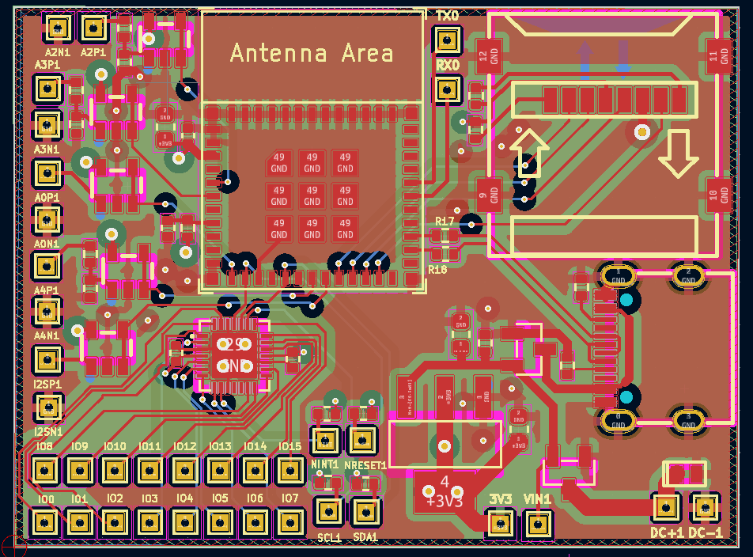

# Remote Data Logger
Remote data logger project for use in engineering development and debugging of electronics in the field

## Feature List

### Hardware
- ESP32-C3 circuit
- 5 ADC
- 16 GPIO
- USB-C
- uSD card
- 44mm x 33mm



### Firmware
- ADC reading
- UART read/write
- Store values to uSD card
- Send values via WiFi/ MQTT

### Software
- Graph readings from ESP32-C3
- Talk with ESP32-C3 through Wi-Fi
- Talk with ESP32-C3 through UART

## Git
Update submodules manually:
```
git submodule update  --init --recursive
```

Configure repo to use custom `.githooks` path and make files executable:
```
git config --local core.hooksPath .githooks/
chmod -R +x .githooks
```

## KiCAD Hotkeys
- `e` while routing:  change parameters of trace
- `b` re-pour copper fills
    - `ctrl + b` to remove all fills
- `u` select entire track
- `v` via when routing
    - switch to bottom when not routing
- `c` Design rule check panel
    - custom hotkey
